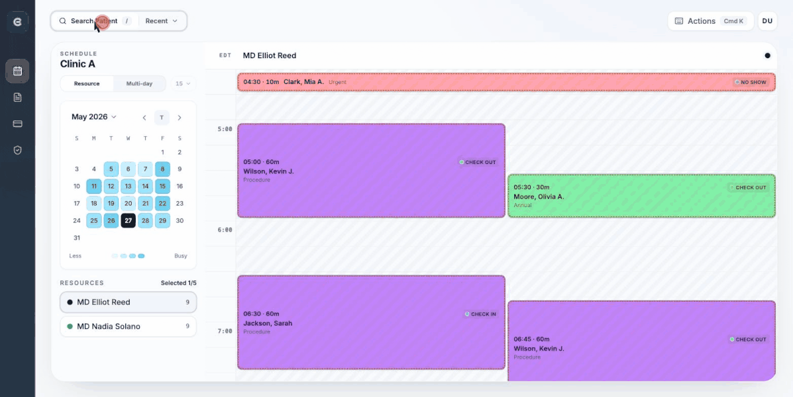
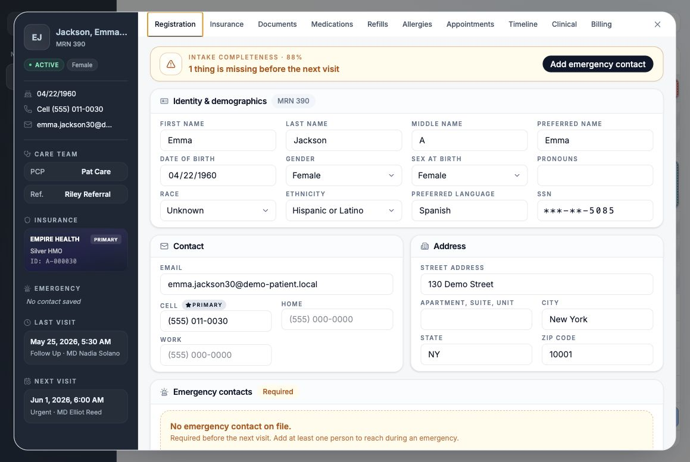
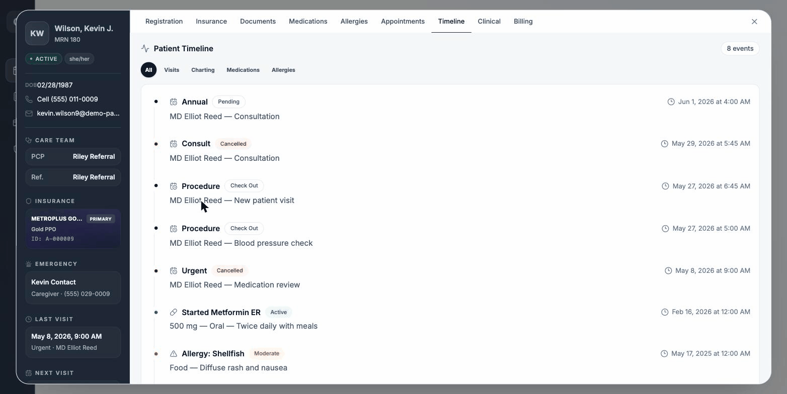
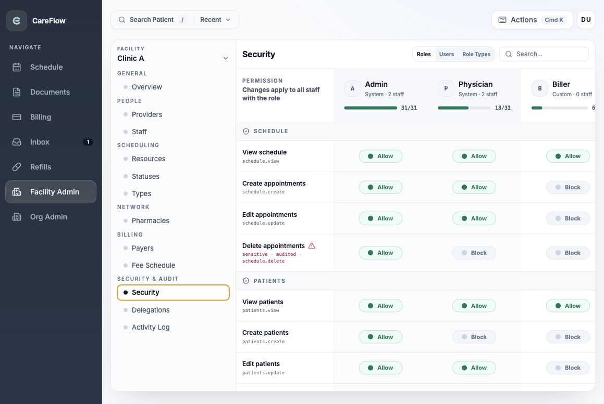

# CareFlow

[](https://github.com/xinyiklin/careflow/actions/workflows/ci.yml)
[](https://careflow.xinyiklin.com)
[](./LICENSE)

CareFlow is a full-stack EHR-style clinic workflow demo for scheduling,
patient registration, clinical charting, documents, billing, facility
administration, and organization administration.

The project is designed as a portfolio-grade healthcare operations app rather
than a basic CRUD sample. It focuses on facility-scoped workflows, configurable
clinical scheduling, secure-by-default data handling, and UI patterns that feel
closer to a real clinic workspace.

## Live Demo

https://careflow.xinyiklin.com

CareFlow uses synthetic demo data only. It is not production medical software,
not a real EHR, and has not been formally audited or certified for HIPAA
compliance.



## Highlights

- **Scheduling** with facility-local time, configurable statuses, visit types,
  resources, rooms, and blocks. Multi-column views, drag-to-reschedule guards,
  appointment heatmap, and per-day interval customization.
- **Patient Hub** with smart search, Quick Start registration, inline
  demographics editing, masked SSN with auditable reveal, emergency contacts,
  care-team details, pharmacy preferences, and security-aware tabs.
- **Clinical charting** with encounters and SOAP progress notes per
  appointment, draft and signed states, sign/unsign workflow, and
  encounter-linked billing handoff.
- **Medications and allergies** tracked per patient with active/historical
  status, severity, reaction, prescriber, and audit history.
- **Billing** with encounter-linked superbills, organization fee schedules,
  facility-level overrides, and a predefined CPT catalog for bulk-populating
  schedules.
- **Document Center** with patient-scoped uploads, preview/download, category
  management, optional Cloudflare R2/S3 storage, and combined PDF export.
- **Org and facility admin** for staff, role types, a security permission
  matrix at both org and facility scope, payer preferences, pharmacy
  preferences, fee schedules, and a read-only activity log.
- **Hardening**: facility-scoped APIs, short-lived JWT access plus HTTP-only
  refresh cookies, CSRF on cookie-backed routes, SSN encrypted at rest with
  Fernet, and audit events for sensitive mutations.

## Screenshots

### Patient Hub

Per-patient workspace with identity, insurance, care team, emergency contacts,
and tab navigation across demographics, documents, medications, allergies,
appointments, clinical charting, billing, and the unified Timeline.



### Patient Timeline

A chronological cross-cut of a patient's history — appointments, encounters,
progress notes, medications, and allergies — aggregated via a shared
`TimelineFeed` primitive reused across audit, history, and note-review
surfaces.



### Facility Security &amp; Permissions

Role-based permission matrix at facility scope, with sensitive actions flagged
as audited and per-role staff counts. Org-level permissions and an org/facility
audit log live under the same admin shell.



## Tech Stack

| Layer | Technology |
| --- | --- |
| Frontend | React 19, Vite, React Router, React Query, Tailwind CSS v4 tokens, Material UI date pickers |
| Backend | Django, Django REST Framework, Simple JWT, Whitenoise |
| Database | PostgreSQL |
| Documents | Local filesystem for development; Cloudflare R2/S3-compatible storage optional |
| Deployment | Vercel frontend, Render backend |

## Project Structure

```text
backend/
  allergies/        Patient allergy and adverse reaction records
  appointments/     Scheduling and appointment activity APIs
  audit/            Audit-style event records
  billing/          Encounter-linked superbills, fee schedules, and CPT catalog
  clinical/         Encounters and progress note charting
  facilities/       Facilities, staff, resources, roles, and configuration
  insurance/        Insurance carriers and patient policies
  medications/      Patient medication records
  organizations/    Organization profile and membership APIs
  patients/         Patients, search, demographics, documents, pharmacies
  shared/           Cross-domain models, serializers, and seed utilities
  users/            Auth, memberships, and user preferences

frontend/src/
  app/              App shell, routing, providers, and error boundary
  features/         Admin, appointments, auth, billing, documents,
                    facilities, patients, schedule
  shared/           API client, UI primitives, constants, hooks, tokens
```

## Local Setup

### Backend

```bash
cd backend
python -m venv venv
source venv/bin/activate
pip install -r requirements.txt
```

Create `backend/.env` for local settings as needed:

```bash
DEBUG=True
SECRET_KEY=careflow-dev-secret-key-change-me
DB_NAME=careflow
DB_USER=careflow_user
DB_PASSWORD=password
DB_HOST=localhost
DB_PORT=5433
DEMO_MODE=True
DEMO_USERNAME=demo
# FIELD_ENCRYPTION_KEY is required when DEBUG=False; a dev default is used
# in DEBUG mode so local setup does not need to set one.
```

Run migrations, seed synthetic demo data, and start the API:

```bash
python manage.py migrate
python manage.py seed_demo
python manage.py runserver
```

The backend serves versioned APIs under `/v1/`.
Use `python manage.py seed_patient_documents` only when you want to refresh or
add sample patient documents without reseeding the full database.

### Frontend

```bash
cd frontend
npm install
```

Create `frontend/.env.local` if the API is not using the default local URL:

```bash
VITE_API_URL=http://localhost:8000
VITE_APP_URL=http://localhost:5173
VITE_DEMO_MODE=true
```

Start the Vite dev server:

```bash
npm run dev
```

The frontend dev server is expected to use `http://localhost:5173`. Vite is
configured with `strictPort`, so do not switch to another port for normal
CareFlow QA. If `5173` is occupied, first check whether the CareFlow frontend is
already running there and use it if it is; otherwise stop the stale process and
restart with `npm run dev`.

## Demo Credentials

After running `python manage.py seed_demo`:

```text
Username: demo
Password: Admin123!
```

The demo user is granted full security permissions across every facility in
the seeded organization. Additional seeded accounts cover physician, nursing,
staff, and facility-admin roles for role-based workflow testing.

## Verification

Backend:

```bash
cd backend
./venv/bin/python manage.py check
./venv/bin/python manage.py test
```

Frontend:

```bash
cd frontend
npm run lint
npx tsc --noEmit
npm run build
```

For major UI changes, run the app locally and visually inspect the changed flow
in Chrome.

## Document Storage

Local development stores uploaded/generated document files under
`backend/local_documents/`, which is intentionally gitignored. Database rows
store metadata and storage keys, not file bytes.

For object storage, configure the R2/S3-compatible backend with:

```bash
PATIENT_DOCUMENT_STORAGE_BACKEND=r2
CLOUDFLARE_R2_ACCOUNT_ID=...
CLOUDFLARE_R2_ACCESS_KEY_ID=...
CLOUDFLARE_R2_SECRET_ACCESS_KEY=...
CLOUDFLARE_R2_BUCKET=...
CLOUDFLARE_R2_ENDPOINT_URL=...
```

## Development Notes

- Keep patient data synthetic. Do not use real PHI in local, demo, or portfolio
  environments.
- Use [PRODUCT.md](./PRODUCT.md) for product context and
  [DESIGN.md](./DESIGN.md) for token/component vocabulary before larger UI
  changes.
- Treat sensitive fields as masked by default. Full SSN display should be
  intentional and user-triggered.
- Keep APIs facility-scoped and permission-aware.
- Keep UI compact, calm, and workflow-oriented rather than schema-oriented.
- Prefer modular feature files and reusable shared UI primitives as workflows
  grow.

## License

This project is not open source. The source code is provided for portfolio
review and demonstration only. See [LICENSE](./LICENSE) for the full
all-rights-reserved notice.
