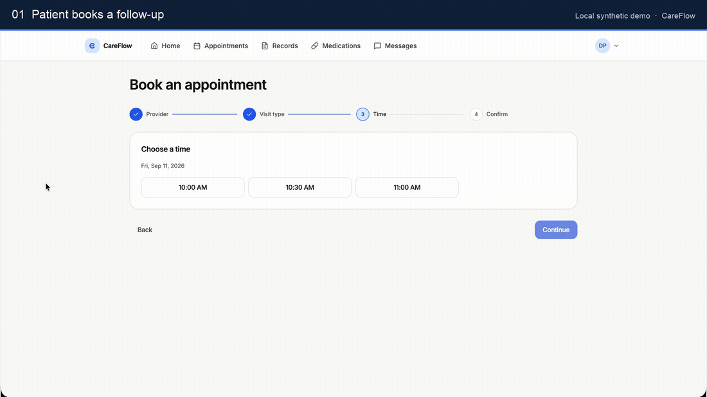
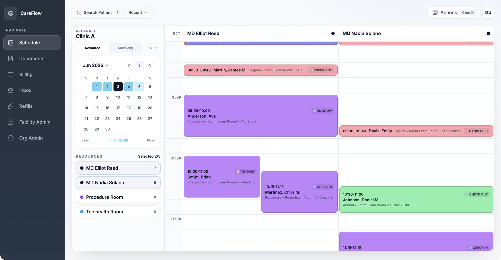
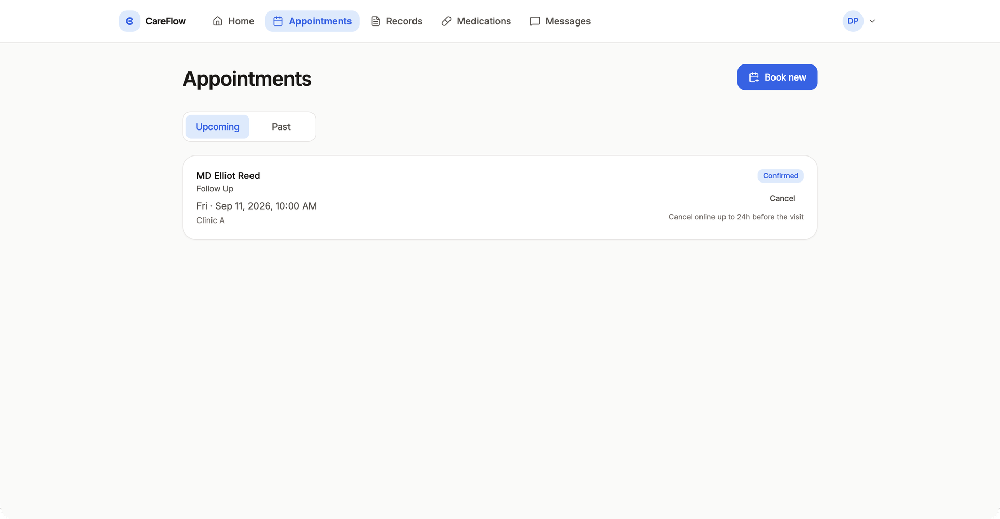
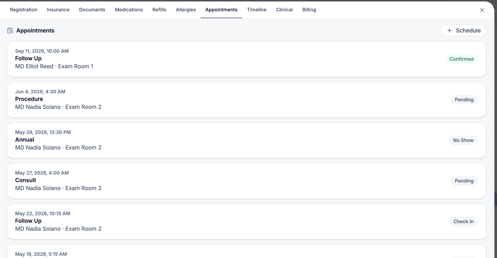
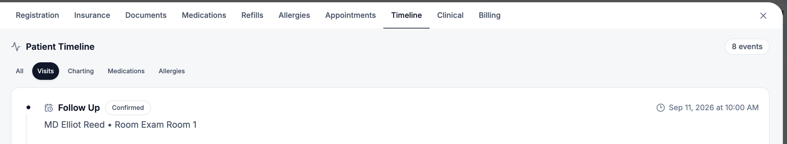
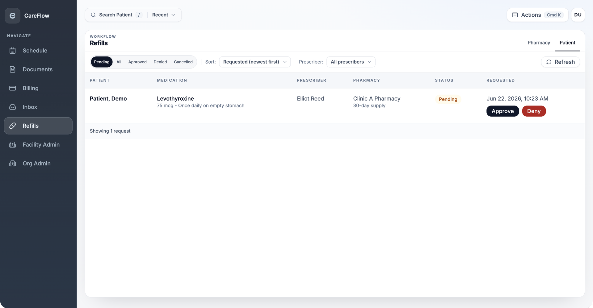
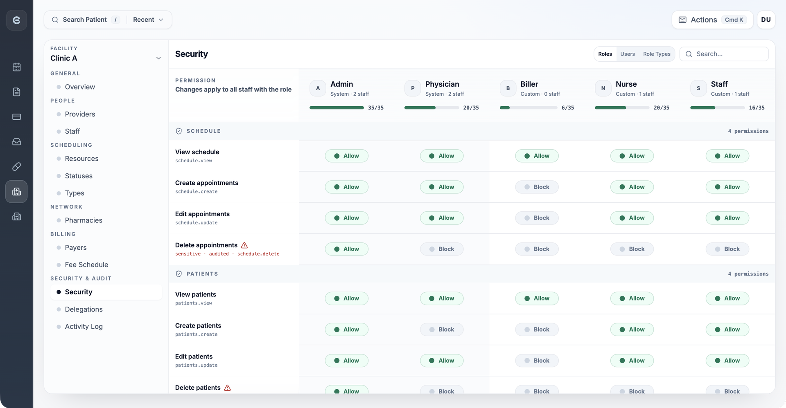

# CareFlow

[](https://github.com/xinyiklin/careflow/actions/workflows/ci.yml)
[](https://careflow.xinyiklin.com)
[](https://clinician.xinyiklin.com)
[](https://patient.xinyiklin.com)
[](./LICENSE)

CareFlow connects patient self-service with a facility-scoped clinician
workspace: book a visit, find it on the schedule, and open the patient's chart.
It is a full-stack portfolio project built with React, TypeScript, Django,
Django REST Framework, and PostgreSQL.

[Watch the workflow](./docs/screenshots/demo.mp4) ·
[Try the demo](#try-the-demo) · [Architecture](./docs/engineering/architecture.md) ·
[Run locally](#local-setup)

## Watch the workflow

[](./docs/screenshots/demo.mp4)

**Patient books → staff assign a resource → Schedule → Patient Hub.**
61 seconds · 1080p · muted with captions · recorded locally on September 8, 2026.
[Open or download the full recording](./docs/screenshots/demo.mp4).

CareFlow uses synthetic data. It is not production medical software and has
not been formally audited or certified for HIPAA compliance. See the [capture runbook](./docs/demo-runbook.md) for provenance, setup, and limits.

## Try the demo

| Surface | Open |
| --- | --- |
| Project overview | [CareFlow](https://careflow.xinyiklin.com) |
| Staff workspace | [Clinician app](https://clinician.xinyiklin.com) |
| Patient self-service | [Patient portal](https://patient.xinyiklin.com) |
| Backend | [API](https://api.careflow.xinyiklin.com) |

Choose **Continue with Demo** on either portal's sign-in page when demo access
is enabled. For a connected walkthrough:

1. **Patient:** choose a provider, visit type, and available time; confirm the visit.
2. **Clinician:** find the patient in Hub → Appointments. Portal bookings have no
   resource assignment; assign a resource using the existing appointment form,
   then select that resource and date in Schedule.
3. **Patient Hub:** open that patient's workspace and review the relevant history.

Available dates depend on the environment's current demo data. Use the
[runbook](./docs/demo-runbook.md) to preflight local capture and clean up a demo
booking without reseeding a shared database.

## Engineering strengths

- **Connected scheduling.** Facility-local times, duration-aware resource and
  provider conflict checks, configurable visit types, and separate patient
  booking/cancellation rules. Staff can explicitly confirm an intentional
  overlap; patients cannot override one. Database locking guards final writes;
  booking presence is advisory.
- **Explicit access boundaries.** Facility-scoped staff APIs and a separate
  patient namespace resolve access on the server. Access tokens carry a surface
  claim; API-host refresh cookies use separate paths for the two portals.
- **Patient workflows.** Patient Hub brings together registration, appointments,
  clinical charting, documents, medications, allergies, billing, and timeline
  views. Patient refill requests feed the staff queue.
- **Deliberate data handling.** SSNs are encrypted at rest and masked by default;
  reveal is intentional and audited. Audit coverage is operation-specific:
  clinician messaging writes audit events, while portal messaging and booking
  do not currently do so. This is not a compliance claim.
- **Shared contracts.** Django OpenAPI output generates the TypeScript API
  package; CI checks contract drift. Shared icon and clinician/landing token
  packages keep narrow reuse boundaries across independently deployed apps.

For the implementation and its limits, see
[architecture](./docs/engineering/architecture.md),
[backend guidance](./docs/engineering/backend-guidelines.md), and
[verification](./docs/engineering/testing.md).

## Screenshots

### Clinician schedule

Two resource columns keep visit times, duration, status, and overlapping
appointments visible. This gallery shows June 3, 2026 synthetic data; its calendar date is distinct
from the September 11 visit booked in the recording.



### Patient portal

Patients can review their upcoming visit and reach scheduling, records,
medications, and messages from a separate workspace.



### Patient Hub and timeline

The Appointments and Visits timeline views show the same booking in context.
These captures crop out the patient identity sidebar. The timeline is a close
crop of the newly booked visit; historical visit reasons are excluded.





### Refill inbox

A pending synthetic request keeps medication, prescriber, pharmacy, status,
and available actions together without opening free-text history.



### Facility security

The role matrix shows permissions within the selected facility.



## Tech Stack

| Layer | Technology |
| --- | --- |
| Frontend | React 19 + TypeScript, Vite, React Router, TanStack Query, Tailwind CSS v4 tokens, Material UI date pickers (clinician), i18next (patient portal) |
| Backend | Django, Django REST Framework, Simple JWT, Whitenoise |
| Database | PostgreSQL |
| Documents | Local filesystem for development; Cloudflare R2/S3-compatible storage optional |
| Deployment | AWS Amplify frontends, Render backend |

## Project Structure

```text
backend/
  allergies/        Patient allergy and adverse reaction records
  appointments/     Scheduling and appointment activity APIs
  audit/            Audit-style event records
  billing/          Encounter-linked superbills, fee schedules, and CPT catalog
  clinical/         Encounters and progress note charting
  facilities/       Facilities, staff, resources, roles, and configuration
  insurance/        Insurance carriers and patient policies
  medications/      Patient medications, refill requests, prescriber delegation
  messaging/        Secure clinician–patient message threads with audit hooks
  organizations/    Organization profile and membership APIs
  patients/         Patients, search, demographics, documents, pharmacies
  shared/           Cross-domain models, serializers, and seed utilities
  users/            Auth, memberships, portal accounts, and user preferences

apps/clinician/src/
  app/              App shell, routing, providers, and error boundary
  features/         Admin, appointments, auth, billing, documents, facilities,
                    medications (refills), messaging, patients, schedule
  shared/           API client, UI primitives, constants, hooks, tokens

apps/patient/src/
  app/              App shell, routing, and providers
  features/         Dashboard, profile, appointments (booking/cancel),
                    medications + refills, allergies, medical summary, messages
  i18n/             Locale resources (en, es, zh-CN, zh-TW)
  shared/           API client, UI primitives, theme, hooks, config

apps/landing/src/
  app/              App entry and theme
  components/       Hero, Portals, Highlights, Header, Footer, ScreenFrame

packages/
  api-types/        Generated OpenAPI types shared across frontend apps
  ui-icons/         Shared CareFlow icon and brand components
```

## Local Setup

### Prerequisites

- Node.js 24.18.0 LTS (run `nvm use` at the repository root when using nvm)
- Python 3.12 for the Django backend

### Backend

```bash
cd backend
python -m venv venv
source venv/bin/activate
pip install -r requirements.txt
```

Create `backend/.env` for local settings as needed:

```bash
DEBUG=True
SECRET_KEY=careflow-dev-secret-key-change-me
DB_NAME=careflow
DB_USER=careflow_user
DB_PASSWORD=password
DB_HOST=localhost
DB_PORT=5433
DEMO_MODE=True
DEMO_USERNAME=demo
# FIELD_ENCRYPTION_KEY is required when DEBUG=False; a dev default is used
# in DEBUG mode so local setup does not need to set one.
```

Run migrations, seed synthetic demo data, and start the API:

```bash
python manage.py migrate
python manage.py seed_demo
python manage.py runserver
```

The backend serves versioned APIs under `/v1/`.
Use `python manage.py seed_patient_documents` only when you want to refresh or
add sample patient documents without reseeding the full database.

### Frontend

```bash
npm install
```

Run from the repo root — npm workspaces install dependencies for every app
(`apps/clinician`, `apps/patient`, `apps/landing`) and the shared `packages/`
(`api-types`, `ui-icons`) in one pass.

Create `apps/clinician/.env.local` if the API is not using the default local URL:

```bash
VITE_API_URL=http://localhost:8000
VITE_DEMO_MODE=true
```

Start the Vite dev server:

```bash
npm run dev:clinician
```

Or from inside `apps/clinician/`, `npm run dev`.

The clinician dev server is expected to use `http://localhost:5173`. Vite is
configured with `strictPort`, so do not switch to another port for normal
CareFlow QA. If `5173` is occupied, first check whether the CareFlow frontend is
already running there and use it if it is; otherwise stop the stale process and
restart with `npm run dev`.

The patient portal runs separately on `http://localhost:5174`, and the landing
page on `http://localhost:5175`:

```bash
npm run dev:patient
npm run dev:landing
```

## Demo Credentials

After running `python manage.py seed_demo`:

```text
Username: demo
Password: Admin123!
```

The demo user is granted full security permissions across every facility in
the seeded organization. Additional seeded accounts cover physician, nursing,
staff, and facility-admin roles for role-based workflow testing.

Patient portal demo account (linked to a seeded patient via
`PatientPortalAccount`):

```text
Username: patient_demo
Password: Patient123!
```

## Verification

Backend:

```bash
cd backend
./venv/bin/python manage.py check
./venv/bin/python manage.py test
```

Frontend (clinician):

```bash
npm -w @careflow/clinician run lint
npm -w @careflow/clinician run typecheck
npm -w @careflow/clinician run build
```

Frontend (patient portal):

```bash
npm run lint:patient
npm run typecheck:patient
npm run build:patient
```

Frontend (landing):

```bash
npm run lint:landing
npm run typecheck:landing
npm run build:landing
```

For major UI changes, run the app locally and visually inspect the changed flow
in Chrome.

## Document Storage

Local development stores uploaded/generated document files under
`backend/local_documents/`, which is intentionally gitignored. Database rows
store metadata and storage keys, not file bytes.

For object storage, configure the R2/S3-compatible backend with:

```bash
PATIENT_DOCUMENT_STORAGE_BACKEND=r2
CLOUDFLARE_R2_ACCOUNT_ID=...
CLOUDFLARE_R2_ACCESS_KEY_ID=...
CLOUDFLARE_R2_SECRET_ACCESS_KEY=...
CLOUDFLARE_R2_BUCKET=...
CLOUDFLARE_R2_ENDPOINT_URL=...
```

## Development Notes

- Keep patient data synthetic. Do not use real PHI in local, demo, or portfolio
  environments.
- Use [PRODUCT.md](./PRODUCT.md) for product context and
  [DESIGN.md](./DESIGN.md) for token/component vocabulary before larger UI
  changes.
- Treat sensitive fields as masked by default. Full SSN display should be
  intentional and user-triggered.
- Keep APIs facility-scoped and permission-aware.
- Keep UI compact, calm, and workflow-oriented rather than schema-oriented.
- Prefer modular feature files and reusable shared UI primitives as workflows
  grow.

## License

This project is not open source. The source code is provided for portfolio
review and demonstration only. See [LICENSE](./LICENSE) for the full
all-rights-reserved notice.
